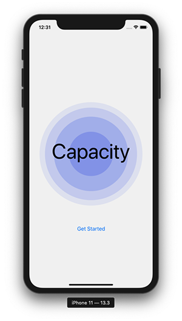
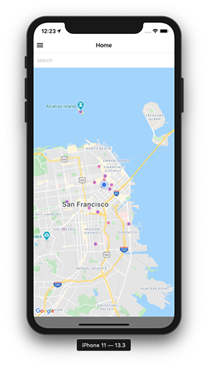
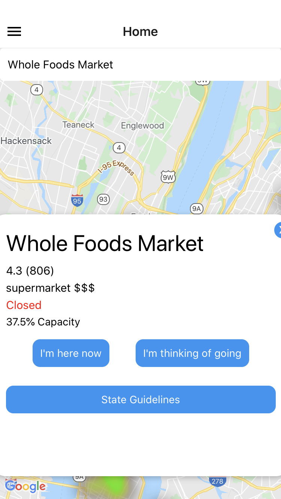
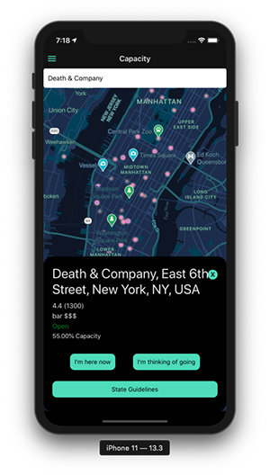
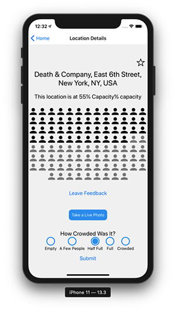
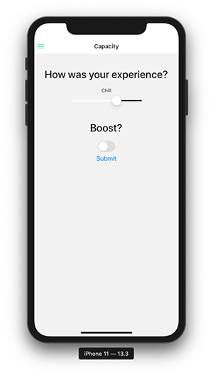
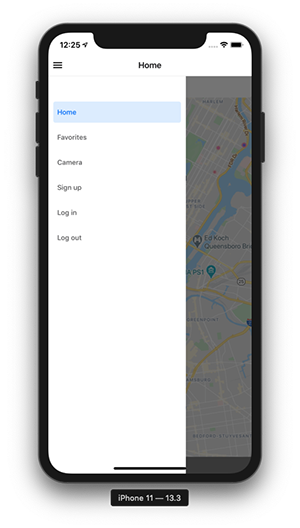
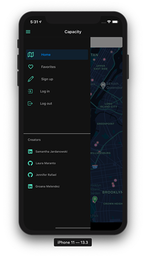

## CAPACITY

Capacity is a location based app that uses crowd sourced reviews to allow users the ability to see in real time how busy a location is. With a dynamic heatmap layered over establishments, we are giving people the ability to better plan their trips whether it's an afternoon at the grocery store, or a night out in an unfamiliar city where they'd like to get a taste of the local nightlife. 

In this way Capacity is a multifaceted app. It can be either used during a global pandemic giving users a tool to help them avoid large crowds when possible, or it can be used in a post-Covid world where human interactions will be even more important. 

## Tech Stack 

Capacity was writtten in React Native powered by Expo-cli. Below is a list of other technologies used throughtout the project. 

   ## Front End 
   - React Native
   - Redux
   - Google Places API 

   ## Back End 
   - Firebase
   - Cloud FireStore 


## Running this project:

- git clone https://github.com/capacity-gljs/capacity-2.0.git
- cd capacity-2.0 
- sign up for a google maps API key [here](https://console.cloud.google.com/project/_/apiui/credential?_ga=2.216759187.405750028.1610228273-1449149429.1599663870) (For a full set of instructions visit the [this page](https://developers.google.com/maps/documentation/javascript/get-api-key))
- create keys for your Firebase config file by creating a Firebase account and creating a project. See instructions [here](https://firebase.google.com/docs/web/setup)
- create a file titled `API_KEYS.JS` in the root of your project
- copy and paste the following into your file and replace the X's with your api key from Google and the firebase config object from Firebase
    ```json
    export const MAP_KEY = "XXXX";

    export const FIRE_CONFIG = {
        apiKey: "XXXX",
        authDomain: "XXXX",
        databaseURL: "XXXX",
        projectId: "XXXX",
        storageBucket: "XXXX",
        messagingSenderId: "XXXX",
        appId: "XXXX",
        measurementId: "XXXX",
    }
    ```
- npm install 
- npm start 

## Viewing Published App
Note: testing this app requires downloading 'expo client' on an iOS  product.

1. On your iOS device, download [expo client](https://apps.apple.com/us/app/expo-client/id982107779) from the app store.
2. Open the expo app and click on profile.
3. Sign in with the following credentials:

    • Username: **capacity**
    
    • Password: **capacity2020**

4. On the profile page under published projects, click on capacity
5. Sign up for a Capacity account or log in. You can now check on your favorite places and report on how crowded they are!

## Authors

 [Samantha Jardanowski](https://github.com/jathnamas "Samantha's Github") | [Laura Maranto](https://github.com/lwmaranto "Laura's Github")  | [Groana Melendez](https://github.com/groana7 "Groana's Github") |  [Jennifer Rafael](https://github.com/JenniferR326 "Jennifer's Github")

## The App










